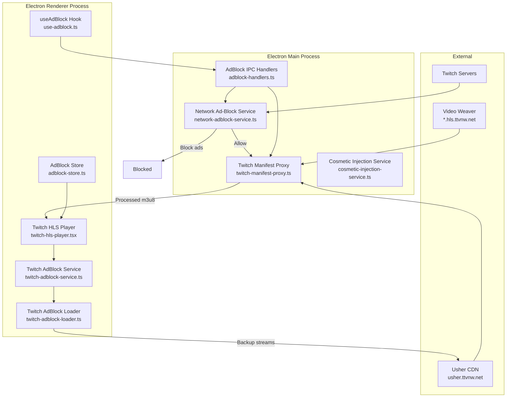
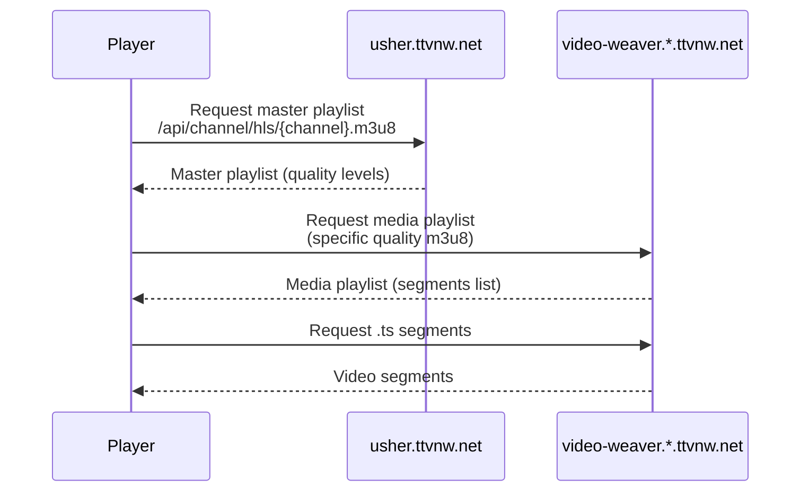
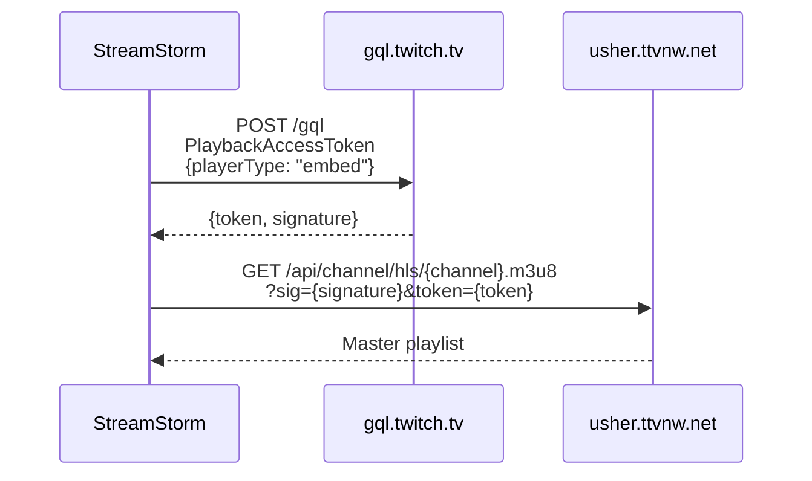
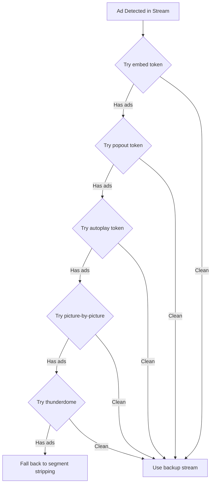
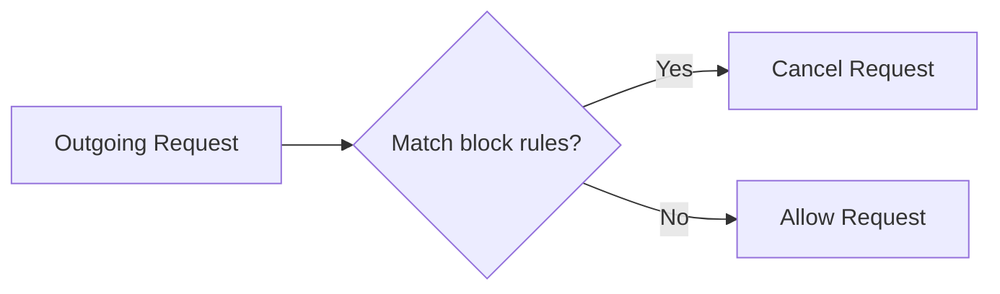
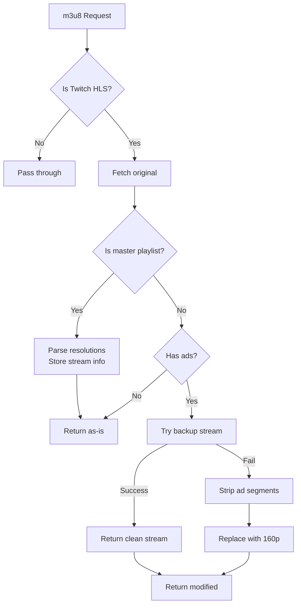
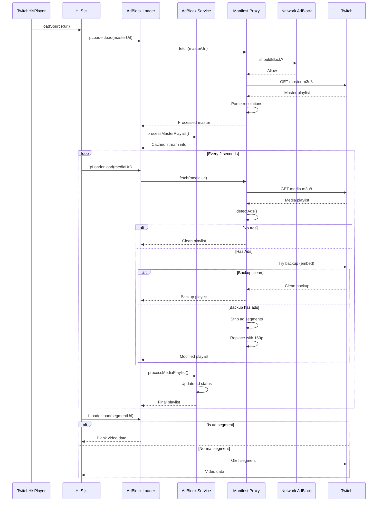

# Twitch Live Stream Ad-Blocking System

> **Version**: 1.0  
> **Last Updated**: January 2026  
> **Based on**: VAFT (Video Ad-Block for Twitch) / TwitchAdSolutions

## Table of Contents

1. [Executive Summary](#executive-summary)
2. [Architecture Overview](#architecture-overview)
3. [How Twitch Ads Work](#how-twitch-ads-work)
4. [Ad-Blocking Techniques](#ad-blocking-techniques)
5. [ULW (Usher Low-Latency Workaround)](#ulw-usher-low-latency-workaround)
6. [Multi-Layer Architecture](#multi-layer-architecture)
7. [Component Deep Dive](#component-deep-dive)
8. [File Structure](#file-structure)
9. [Flow Diagrams](#flow-diagrams)
10. [Configuration Reference](#configuration-reference)
11. [Troubleshooting](#troubleshooting)

---

## Executive Summary

StreamStorm implements a sophisticated **multi-layer ad-blocking system** for Twitch live streams. The system operates at three distinct levels:

1. **Network Layer** (Main Process) - Blocks ad-related URLs before they reach the app
2. **Manifest Proxy Layer** (Main Process) - Intercepts and processes HLS playlists at the Electron session level
3. **HLS Loader Layer** (Renderer Process) - Client-side playlist manipulation with backup stream fetching

This defense-in-depth approach ensures maximum effectiveness against Twitch's evolving ad delivery methods.

---

## Architecture Overview



---

## How Twitch Ads Work

### HLS Stream Architecture

Twitch uses **HLS (HTTP Live Streaming)** for video delivery:



### Ad Injection Process

Twitch injects ads by modifying the **media playlist** (the quality-specific m3u8):

1. **Preroll Ads**: Inserted before stream starts
2. **Midroll Ads**: Triggered by streamer or scheduled
3. **Ad Signifiers**: Tags in the playlist indicate ad content

#### Ad Detection Markers

Ads are identified by these patterns in the m3u8 playlist:

| Marker | Description |
|--------|-------------|
| `stitched` | Primary ad signifier (present in EXTINF tags) |
| `#EXT-X-DATERANGE` with `stitched-ad` | DATERANGE tag for ad segments |
| `com.twitch.tv/ad` | Twitch ad class identifier |
| `amazon-ad` | Amazon ad network indicator |
| `twitch-stitched-ad` | Alternative ad class |
| `X-TV-TWITCH-AD-URL` | Ad tracking URL |
| Missing `,live` in `#EXTINF` | Ad segments lack the "live" tag |

#### Example: Clean vs Ad-Laden Playlist

**Clean Playlist:**
```m3u8
#EXTM3U
#EXT-X-VERSION:3
#EXT-X-TARGETDURATION:2
#EXTINF:2.000,live
https://video-weaver.../v1/segment/12345.ts
#EXTINF:2.000,live
https://video-weaver.../v1/segment/12346.ts
```

**Playlist with Ads:**
```m3u8
#EXTM3U
#EXT-X-VERSION:3
#EXT-X-TARGETDURATION:2
#EXT-X-DATERANGE:ID="stitched-ad-12345",CLASS="twitch-stitched-ad",...
#EXTINF:2.000,
https://d2nvs31859zcd8.cloudfront.net/ad/segment1.ts
#EXTINF:2.000,
https://d2nvs31859zcd8.cloudfront.net/ad/segment2.ts
```

---

## Ad-Blocking Techniques

StreamStorm employs multiple techniques in a layered approach:

### 1. Network-Level Blocking

Block known ad servers completely:

```typescript
// network-adblock-service.ts
const rules: BlockRule[] = [
  { pattern: /^https?:\/\/edge\.ads\.twitch\.tv/i, category: 'ads' },
  { pattern: /^https?:\/\/imasdk\.googleapis\.com/i, category: 'ads' },
  { pattern: /^https?:\/\/pubads\.g\.doubleclick\.net/i, category: 'ads' },
  { pattern: /^https?:\/\/.*\.amazon-adsystem\.com/i, category: 'ads' },
];
```

### 2. Manifest Interception

Intercept HLS playlists at the Electron session level:

```typescript
// twitch-manifest-proxy.ts
session.defaultSession.webRequest.onBeforeRequest(
  { urls: ['*://*.ttvnw.net/*.m3u8*'] },
  async (details, callback) => {
    const processedText = await this.processManifest(url, originalText);
    callback({
      redirectURL: `data:application/vnd.apple.mpegurl;base64,${base64}`,
    });
  }
);
```

### 3. Backup Stream Fetching (ULW)

Fetch alternative streams with different player tokens - see next section.

### 4. Ad Segment Stripping

Remove ad segments from playlists and replace with:
- **160p segments** (low-quality filler from clean stream)
- **Blank video** (minimal valid MP4)

### 5. Tracking URL Neutralization

Replace ad tracking URLs with safe placeholders:

```typescript
text.replace(/(X-TV-TWITCH-AD-URL=")[^"]*(")/g, `$1https://twitch.tv$2`)
```

---

## ULW (Usher Low-Latency Workaround)

### What is ULW?

ULW exploits how Twitch determines whether to show ads based on the **player type** in the access token request. Different player contexts (embed, popout, etc.) may receive different ad policies.

### The Access Token System

When requesting a stream, you must obtain an **access token** from Twitch's GQL API:



### Player Types and Ad Behavior

| Player Type | Description | Ad Behavior |
|-------------|-------------|-------------|
| `site` | Main website player | All ads |
| `embed` | Embedded player | May skip preroll |
| `popout` | Pop-out window | Often ad-free |
| `autoplay` | Android autoplay | Often ad-free |
| `picture-by-picture` | PiP mode | Often ad-free |
| `thunderdome` | Internal player | Often ad-free |

### The ULW Technique

1. When ads are detected in the primary stream
2. Request new access tokens with alternative `playerType` values
3. Use the first token that returns an ad-free stream
4. Fall back to segment stripping if all types have ads



### Critical: Stripping parent_domains

Twitch detects embedded players by checking `parent_domains` in the token. **This MUST be stripped**:

```typescript
// CRITICAL: Strip parent_domains to bypass embed detection
const tokenValue = JSON.parse(token.value);
delete tokenValue.parent_domains;
delete tokenValue.parent_referrer_domains;

return {
  signature: token.signature,
  value: JSON.stringify(tokenValue),
};
```

Without this, backup streams will also show ads.

---

## Multi-Layer Architecture

### Layer 1: Network Ad-Block Service (Main Process)

**File**: `src/backend/services/network-adblock-service.ts`

Blocks requests to known ad servers before they even load:



**Blocked domains:**
- `edge.ads.twitch.tv` - Twitch ad server
- `imasdk.googleapis.com` - Google IMA SDK
- `pubads.g.doubleclick.net` - DoubleClick
- `*.amazon-adsystem.com` - Amazon Ads
- `spade.twitch.tv` - Analytics/telemetry
- `science.twitch.tv` - Telemetry

### Layer 2: Twitch Manifest Proxy (Main Process)

**File**: `src/backend/services/twitch-manifest-proxy.ts`

Intercepts and processes HLS manifests at the Electron session level:



**Key features:**
- Transparent to renderer (no client code needed)
- Processes ALL Twitch m3u8 requests
- Caches stream info for segment replacement
- Returns processed playlists as base64 data URLs

### Layer 3: Client-Side HLS Loader (Renderer Process)

**Files**: 
- `src/components/player/twitch/twitch-adblock-service.ts`
- `src/components/player/twitch/twitch-adblock-loader.ts`

Custom HLS.js loaders that intercept playlist loading:

```typescript
// twitch-adblock-loader.ts
const hls = new Hls({
  pLoader: createAdBlockPlaylistLoader(channelName), // Playlist loader
  fLoader: createAdBlockFragmentLoader(),            // Fragment loader
});
```

**Playlist Loader (pLoader):**
- Intercepts master/media playlist requests
- Processes through TwitchAdBlockService
- Handles backup stream fetching

**Fragment Loader (fLoader):**
- Intercepts segment requests
- Replaces ad segments with blank video

---

## Component Deep Dive

### TwitchAdBlockService

**File**: `src/components/player/twitch/twitch-adblock-service.ts`

The core ad-blocking logic for client-side processing.

#### Key Functions

| Function | Purpose |
|----------|---------|
| `processMasterPlaylist()` | Parse quality levels, store stream info |
| `processMediaPlaylist()` | Detect ads, fetch backups, strip segments |
| `getAccessToken()` | Request GQL token with specific playerType |
| `tryGetBackupStream()` | Iterate through player types for clean stream |
| `stripAdSegments()` | Remove ad segments from playlist |
| `detectAds()` | Multi-heuristic ad detection |

#### Ad Detection Heuristics

```typescript
function detectAds(text: string, streamInfo: StreamInfo) {
  // 1. DATERANGE detection (most reliable)
  if (text.includes('#EXT-X-DATERANGE') && 
      (text.includes('stitched-ad') || text.includes('com.twitch.tv/ad'))) {
    return { hasAds: true, method: 'DATERANGE' };
  }
  
  // 2. Stitched signifier
  if (text.includes('stitched')) {
    return { hasAds: true, method: 'stitched' };
  }
  
  // 3. Bitrate drop detection (optional)
  if (config.useBitrateDropDetection && streamInfo.lastKnownBitrate) {
    const currentBitrate = parseBitrate(text);
    if (currentBitrate / streamInfo.lastKnownBitrate < 0.3) {
      return { hasAds: true, method: 'bitrate-drop' };
    }
  }
  
  return { hasAds: false };
}
```

### TwitchManifestProxy

**File**: `src/backend/services/twitch-manifest-proxy.ts`

Main process interceptor for transparent ad blocking.

#### Registration

```typescript
// main.ts
twitchManifestProxy.registerInterceptor();
```

#### URL Patterns Intercepted

| Pattern | Type |
|---------|------|
| `*://*.ttvnw.net/*.m3u8*` | All Twitch HLS manifests |
| `usher.ttvnw.net` | Master playlists |
| `video-weaver.*` | Media playlists |
| `*.hls.ttvnw.net` | Alternative CDN |

### AdBlock Store

**File**: `src/store/adblock-store.ts`

Zustand store for persisting ad-block preferences:

```typescript
interface AdBlockState {
  enableAdBlock: boolean;
  setEnableAdBlock: (enabled: boolean) => void;
  toggleAdBlock: () => void;
}
```

Persisted to localStorage under key `streamstorm-adblock`.

---

## File Structure

```
StreamStorm/
├── src/
│   ├── main.ts                                    # Electron entry, registers interceptors
│   │
│   ├── backend/
│   │   ├── services/
│   │   │   ├── network-adblock-service.ts        # [Layer 1] URL blocking
│   │   │   ├── twitch-manifest-proxy.ts          # [Layer 2] HLS interception
│   │   │   └── cosmetic-injection-service.ts     # DOM element hiding
│   │   │
│   │   └── ipc/
│   │       └── handlers/
│   │           └── adblock-handlers.ts           # IPC for adblock status/toggle
│   │
│   ├── components/
│   │   └── player/
│   │       └── twitch/
│   │           ├── twitch-hls-player.tsx         # HLS player with adblock integration
│   │           ├── twitch-adblock-service.ts     # [Layer 3] Client-side logic
│   │           ├── twitch-adblock-loader.ts      # Custom HLS.js loaders
│   │           ├── twitch-live-player.tsx        # Live stream wrapper
│   │           └── ad-block-fallback-overlay.tsx # Fallback UI (disabled)
│   │
│   ├── shared/
│   │   ├── adblock-types.ts                      # Type definitions
│   │   └── ipc-channels.ts                       # IPC channel constants
│   │
│   ├── store/
│   │   └── adblock-store.ts                      # Zustand persistence
│   │
│   └── hooks/
│       ├── use-adblock.ts                        # IPC hook for main process
│       └── use-ad-element-observer.ts            # DOM ad element detection
```

---

## Flow Diagrams

### Complete Ad-Blocking Flow



### Backup Stream Selection

```mermaid
flowchart TD
    A[Ad Detected] --> B[Get current resolution]
    B --> C{i = 0}
    C --> D[Get access token<br/>playerType = backupTypes[i]]
    D --> E{Token received?}
    E -->|No| F{More types?}
    E -->|Yes| G[Build usher URL<br/>Strip parent_domains]
    G --> H[Fetch encodings m3u8]
    H --> I[Find matching resolution]
    I --> J[Fetch media m3u8]
    J --> K{Has ads?}
    K -->|No| L[Return clean backup]
    K -->|Yes| M{Is fallback type?}
    M -->|Yes| N[Save as fallback]
    M -->|No| O[i++]
    N --> O
    O --> F
    F -->|Yes| C
    F -->|No| P{Have fallback?}
    P -->|Yes| Q[Return fallback<br/>Enable stripping]
    P -->|No| R[Strip segments only]
```

---

## Configuration Reference

### AdBlockConfig

```typescript
interface AdBlockConfig {
  enabled: boolean;                      // Master toggle
  adSignifier: string;                   // Default: 'stitched'
  clientId: string;                      // GQL Client ID
  backupPlayerTypes: PlayerType[];       // Order to try
  fallbackPlayerType: PlayerType;        // Last resort
  isAdStrippingEnabled: boolean;         // Strip segments
  useDateRangeDetection: boolean;        // Check DATERANGE tags
  useBitrateDropDetection: boolean;      // Bitrate-based detection
  bitrateDropThreshold: number;          // 0.7 = 70% drop
  use160pReplacement: boolean;           // Replace with 160p
  skipPlayerReloadOnHevc: boolean;       // HEVC handling
  alwaysReloadPlayerOnAd: boolean;       // Force reload
  reloadPlayerAfterAd: boolean;          // Reload when ad ends
  playerReloadMinimalRequestsTime: number;
  playerBufferingFix: boolean;
  // ... more options
}
```

### Default Configuration

```typescript
const DEFAULT_ADBLOCK_CONFIG: AdBlockConfig = {
  enabled: true,
  adSignifier: 'stitched',
  clientId: 'kimne78kx3ncx6brgo4mv6wki5h1ko',
  backupPlayerTypes: ['embed', 'popout', 'autoplay', 'picture-by-picture', 'thunderdome'],
  fallbackPlayerType: 'embed',
  isAdStrippingEnabled: true,
  useDateRangeDetection: true,
  useBitrateDropDetection: true,
  bitrateDropThreshold: 0.7,
  use160pReplacement: true,
  // ...
};
```

### IPC Channels

| Channel | Purpose |
|---------|---------|
| `adblock:get-status` | Get current blocking status |
| `adblock:toggle` | Enable/disable services |
| `adblock:get-stats` | Get blocking statistics |
| `adblock:proxy-status` | Get manifest proxy status |
| `adblock:inject-cosmetics` | Inject CSS rules |

---

## Troubleshooting

### Ads Still Showing

1. **Check if ad-blocking is enabled**
   - Settings > Ad Block toggle
   - `localStorage.getItem('streamstorm-adblock')`

2. **Check manifest proxy**
   - Look for `[ManifestProxy]` logs in main process
   - Verify `twitchManifestProxy.isActive()` returns true

3. **Backup streams also have ads**
   - All player types may show ads for popular streamers
   - This is a Twitch server-side decision
   - Fallback: Segment stripping will activate

### Stream Not Loading

1. **Token issues**
   - Check GQL requests in network tab
   - Verify `Client-ID` header is present

2. **Manifest processing errors**
   - Check for `[ManifestProxy] Error:` logs
   - Verify base64 encoding is correct

### Audio During Ads

- Audio should be seamlessly replaced
- If ad audio bleeds through, check segment stripping timing

### Performance Issues

- Backup stream fetching adds latency (~200-500ms per type)
- Reduce `backupPlayerTypes` array for faster fallback
- Disable `useBitrateDropDetection` if not needed

---

## References

- [TwitchAdSolutions](https://github.com/pixeltris/TwitchAdSolutions) - Original VAFT implementation
- [HLS.js Documentation](https://github.com/video-dev/hls.js) - Custom loader API
- [Twitch GQL API](https://github.com/mauricew/twitch-graphql-api) - Unofficial GQL docs
- [Electron WebRequest API](https://www.electronjs.org/docs/latest/api/web-request) - Request interception
